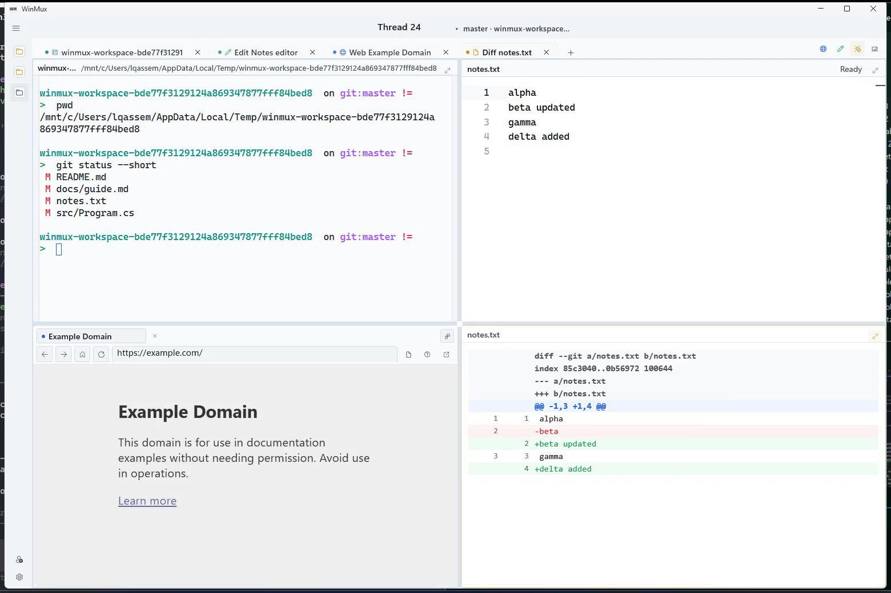
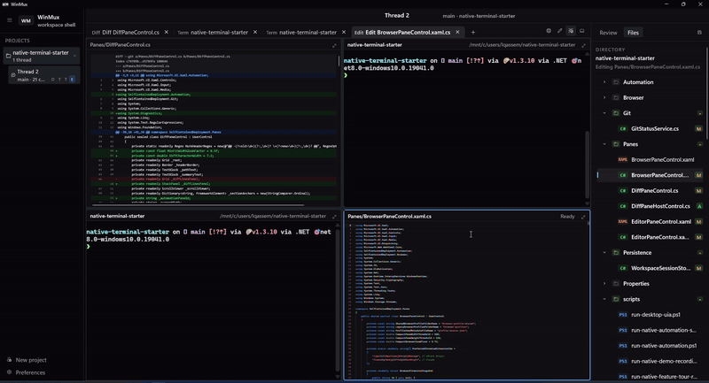
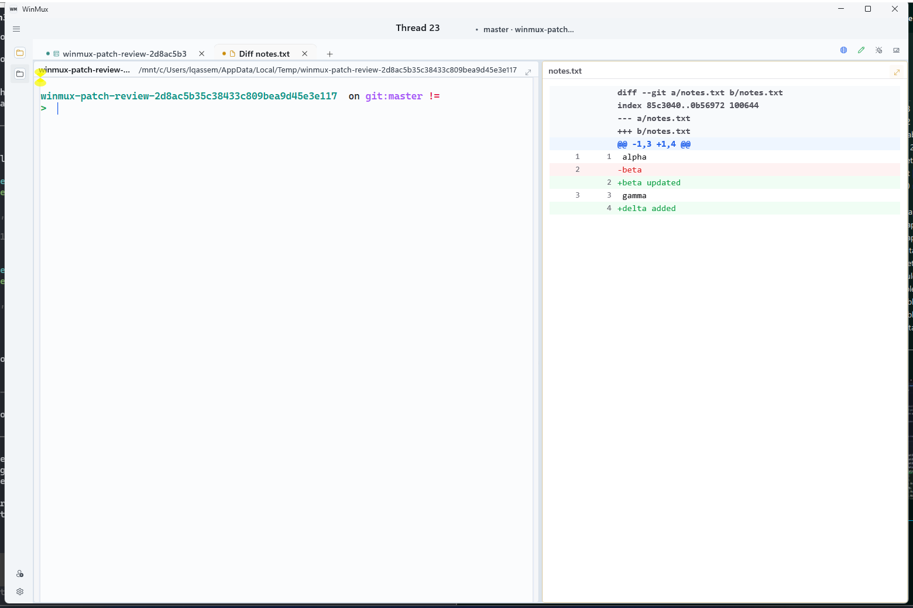

# WinMux

WinMux is a native Windows workspace shell built with WinUI 3, ConPTY, a Windows Terminal-backed native terminal surface, and WebView2 browser/editor panes.

It combines terminals, browser panes, editor panes, patch review, worktree-aware threads, theme-pack-aware session restore, and a full native automation surface that can be driven from Bun. The repo is set up so a human can use the shell directly while an LLM can inspect, drive, screenshot, and record the exact same native app.



## Download

- [Latest Windows installer (.exe)](https://github.com/editnori/WinMux/releases/latest/download/WinMux-win-x64-installer.exe)
- [Latest release notes and assets](https://github.com/editnori/WinMux/releases/latest)
- [Project changelog](CHANGELOG.md)

The release asset is a real installer `.exe` that installs WinMux under `%LocalAppData%\Programs\WinMux` and can launch it immediately after setup.

## Current shell snapshot

WinMux is no longer the original sample shell. The current app now centers on a denser native workspace model:

- project-scoped threads with per-thread pane workspaces and a top pane strip
- native terminal, browser, editor, and patch review surfaces that can all stay visible together
- worktree-aware thread metadata, diff review, inline notes, and inspector-driven file context
- autosaved session replay that preserves theme mode and palette pack choices
- native automation for screenshots, recordings, render traces, UI control, and terminal/browser/editor state capture
- smoother shell polish across sidebar toggles, pane drag preview, live-resize suppression, grouped browser chrome, and heavy pane redraw paths

## Demo

[](docs/media/winmux-demo.mp4)

[Watch the overview clip](docs/media/winmux-demo.mp4)

The current walkthrough shows:

- a scripted workspace showcase from the live native shell, not a mocked browser demo
- quad-pane terminal, editor, browser, and diff review working in one thread
- the refactored pane strip, project/thread shell, and workspace-scoped browser/editor surfaces
- the current patch review workflow and automation-driven capture pipeline used for release media



## What WinMux does

- Native WinUI 3 shell with a dense multi-pane workspace, compact chrome, and switchable theme packs.
- Project and thread model with worktree-aware terminals and overflow-thread behavior when a pane set is already full.
- Terminal, browser, editor, and diff panes in the same workspace, with review-first inspector tooling.
- Inline thread and project notes with pane attachments, archive state, and native automation support.
- Patch review with live/baseline/checkpoint sources, structured diff automation, change navigation, and zoom control.
- Session persistence across app relaunches, including restored pane layouts, replay metadata, and persisted theme mode/theme pack state.
- Native automation routes for shell state, UI tree, UI actions, browser state, terminal state, diff state, editor state, screenshots, recordings, render traces, events, desktop window control, and desktop UIA fallback.

For the fuller feature inventory, see [FEATURES.md](FEATURES.md).

## Why the automation matters

WinMux is not just scriptable around the edges.

The Bun wrappers in this repo let an agent inspect and control the real native app:

- `bun run native:state`
- `bun run native:ui-tree`
- `bun run native:terminal-state`
- `bun run native:browser-state`
- `bun run native:diff-state`
- `bun run native:editor-state`
- `bun run native:screenshot`
- `bun run native:recording-start`
- `bun run native:recording-stop`

That means an LLM can:

- read the live workspace state
- click native controls
- type into terminals
- inspect diff/editor/browser panes
- capture screenshots and recordings
- drive demos and regression flows end to end

## Run locally

```bash
bun install
dotnet run --project .\SelfContainedDeployment.csproj -p:Platform=x64
```

Once the app is running, the main automation helpers are:

```bash
bun run native:health
bun run native:state
bun run native:ui-tree
bun run native:screenshot
```

For browser/editor WebView2 debugging, launch the alternate debug flow:

```bash
bun run webview2:start
```

That path is now for the WebView2-backed panes and CDP tooling. The terminal pane itself is no longer hosted in WebView2.

## Cinematic recordings

The repo now includes a recording suite intended for public demos and shareable walkthroughs.

The media used in this README comes from the same automation path:

- `bun run native:workspace-showcase-recording`
- `bun run native:patch-review-recording`

The main entrypoint is:

```bash
bun run native:recording-suite
```

That suite defaults to cinematic settings and writes a manifest plus per-recording folders under:

```text
tmp/automation-captures/winmux-recording-suite-cinematic-<timestamp>/
```

The suite generates:

- `overview`: broad product walkthrough of the shell chrome, tabs, settings, and thread flows
- `workspace-showcase`: terminals, browser, editor, diff review, file browser, fit/lock/zoom, worktree-scoped terminals, and overflow-thread behavior
- `feature-tour`: project/thread/worktree/browser/review/settings walkthrough
- `patch-review`: focused review recording for the diff surface
- `new-project`: project creation and empty-state recovery
- `tab-switch`: fast pane switching and strip behavior
- `automation-tour`: Bun-driven native control from inside WinMux itself
- `session-restore`: save-state and restored-state clips showing session replay across relaunch

You can also run the focused recordings directly:

```bash
bun run native:demo-recording:cinematic
bun run native:feature-tour-recording
bun run native:workspace-showcase-recording
bun run native:patch-review-recording
bun run native:new-project-recording
bun run native:tab-switch-recording
bun run native:automation-tour-recording
bun run native:session-restore-recording
```

The public-facing recordings default to light mode and explicitly showcase both light and dark themes during the flows.

The current alpha line also supports multiple shell palette packs inside the same light/dark/system theme modes, so release media and saved sessions can keep the same chrome language without forcing a single global color treatment.

## Build an installable publish output

The project already has Windows publish profiles in `Properties/PublishProfiles/`.

For an x64 release publish:

```powershell
& "C:\Program Files\dotnet\dotnet.exe" publish .\SelfContainedDeployment.csproj `
  -c Release `
  -p:Platform=x64 `
  -p:RuntimeIdentifier=win-x64 `
  -p:PublishProfile=Properties\PublishProfiles\win10-x64.pubxml
```

The publish output lands under the standard `bin/Release/.../publish/` path for the target runtime.

Install Inno Setup 6 so `ISCC.exe` is available on your machine, then build the installer used on the release page:

```powershell
powershell -NoProfile -ExecutionPolicy Bypass -File .\scripts\build-winmux-installer.ps1 `
  -PublishDirectory .\bin\Release\net8.0-windows10.0.19041.0\win-x64\publish `
  -AppVersion 0.1.6
```

The installer now bundles a WebView2 bootstrapper for machines that do not already have the runtime, excludes release `.pdb` files, uses a branded wizard header, and defaults to a faster non-solid compression profile so installation feels smoother.

Tagged pushes like `alpha-v0.1.6` run `.github/workflows/windows-release.yml`, publish the x64 build, compile the installer, and attach `WinMux-win-x64-installer.exe` directly to the GitHub Release.

## Repo structure

- `MainPage.*`: native shell layout and workspace model
- `Terminal/`: ConPTY shell coordination plus the native Windows Terminal-backed pane host
- `Panes/`: browser, editor, and diff panes
- `Web/`: WebView2 assets used by browser/editor surfaces
- `Automation/`: native automation server and recording support
- `scripts/`: Bun/PowerShell helpers for automation, demos, and recordings

## Notes

- The app name is WinMux, even though the historical project file is still `SelfContainedDeployment.csproj`.
- Some Windows packaging warnings can still appear on debug launches depending on the local environment, but the main automation and recording flows are designed around the unpackaged debug build.
